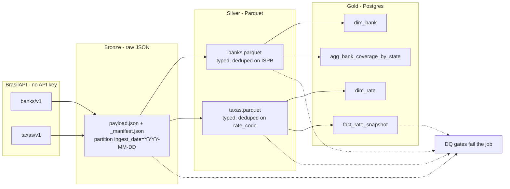

# Brazilian Open Data — Medallion Pipeline

Batch ETL that lands **BrasilAPI** public datasets into a bronze → silver → gold lakehouse. Built as a hiring-manager-ready Data Engineering portfolio project by [Camilo Prado](https://github.com/camiloprado).

This is a real package with a CLI, Docker Compose, SQL-modeled gold tables, and data-quality gates that fail the job. It is not a notebook demo.

## Why these endpoints

| Source | Endpoint | Why it belongs in a daily batch |
| --- | --- | --- |
| Banks | `GET https://brasilapi.com.br/api/banks/v1` | Full BCB COMPE catalog (~470 institutions). Natural **dimension**: ISPB, COMPE code, legal name, headquarters. Changes slowly but is worth snapshotting. |
| Official rates | `GET https://brasilapi.com.br/api/taxas/v1` | Current **Selic**, **CDI**, and **IPCA**. Tiny payload that becomes a **fact** when you keep one snapshot per ingest date. |

Both endpoints are free, documented, and need **no API key**. CEP was skipped because it is a point lookup, not a catalog you can land as a daily batch without inventing a zip list.

## What a recruiter should look at in 5 minutes

1. This README — medallion story, honest stack, how to run.
2. `src/pipeline/schema.py` — column contracts and why each source was chosen.
3. `src/pipeline/silver.py` and `src/pipeline/gold.py` — typing, dedupe, upserts.
4. `sql/init/001_gold_schema.sql` — gold grain and keys.
5. Run it: `docker compose up --build --abort-on-container-exit`, then the sample query below.
6. Run it a second time (`docker compose run --rm pipeline`) and confirm `gold.fact_rate_snapshot` still has **one row per rate per day**.

## Architecture



- **Bronze**: exact HTTP body as landed, plus a manifest (URL, status, SHA-256, row count). Same `ingest_date` is overwritten on re-run.
- **Silver**: documented columns, 8-digit ISPB, UF normalized, duplicate ISPBs dropped, rows without ISPB dropped.
- **Gold**: upsert dimensions and facts. `fact_rate_snapshot` grain is `(snapshot_date, rate_code)`. Coverage by HQ state is rebuilt for that date so re-runs do not double-count.

## Stack (what this repo actually uses)

| Layer | Tool | Notes |
| --- | --- | --- |
| Language | Python 3.11+ (image is 3.12) | Package under `src/pipeline` |
| HTTP | httpx | Retries on 429/5xx |
| Transforms | pandas + pyarrow | Silver written as Parquet |
| Warehouse | PostgreSQL 16 | Docker Compose |
| Config | env vars / pydantic-settings | See `.env.example` |
| Orchestration | none | CLI only — no Airflow/Prefect in this repo |
| Cloud | none | Runs on your laptop |

No fake AWS/GCP services, no warehouse you cannot start locally.

## How to run

### One command (reviewer path)

```bash
docker compose up --build --abort-on-container-exit
```

This starts Postgres, applies `sql/init/001_gold_schema.sql`, extracts BrasilAPI, writes `data/bronze` and `data/silver`, and loads `gold.*`.

Postgres is published on **localhost:55432** (not 5432) so it is less likely to collide with a local database.

### Prove idempotency

```bash
docker compose run --rm pipeline
```

Then:

```bash
docker compose exec postgres \
  psql -U pipeline -d br_open_data -c \
  "SELECT snapshot_date, rate_code, COUNT(*) \
   FROM gold.fact_rate_snapshot GROUP BY 1, 2 HAVING COUNT(*) > 1;"
```

That query must return **zero rows**. `gold.pipeline_run` stays at one row per `ingest_date`.

### Sample gold query

```sql
SELECT
    f.snapshot_date,
    d.rate_name,
    f.rate_value,
    d.unit
FROM gold.fact_rate_snapshot AS f
JOIN gold.dim_rate AS d ON d.rate_code = f.rate_code
WHERE f.snapshot_date = (SELECT MAX(snapshot_date) FROM gold.fact_rate_snapshot)
ORDER BY d.rate_code;
```

More examples live in `sql/examples/recruiter_queries.sql`.

```bash
docker compose exec -T postgres psql -U pipeline -d br_open_data \
  < sql/examples/recruiter_queries.sql
```

### Local Python (optional)

```bash
python3 -m venv .venv
source .venv/bin/activate
pip install -e ".[dev]"
cp .env.example .env
# point POSTGRES_* at the Compose database (port 55432)
python -m pipeline run
pytest
```

CLI:

```text
python -m pipeline run
python -m pipeline run --layers bronze,silver
python -m pipeline run --layers gold
```

`INGEST_DATE=YYYY-MM-DD` freezes the partition (useful for replay). Empty means today's UTC date.

## Gold model

| Table | Grain | Load style |
| --- | --- | --- |
| `gold.dim_bank` | `ispb` | Upsert; `first_seen_date` / `last_seen_date` |
| `gold.dim_rate` | `rate_code` | Upsert (SELIC, CDI, IPCA) |
| `gold.fact_rate_snapshot` | `(snapshot_date, rate_code)` | Upsert — same day never duplicates |
| `gold.agg_bank_coverage_by_state` | `(as_of_date, state)` | Delete+insert for that date |
| `gold.pipeline_run` | `ingest_date` | Upsert run metrics |

`??` is the coverage bucket for banks with no HQ UF.

## Data quality

Hard failures stop the job:

- Banks: ≥ 100 rows, unique non-null 8-digit ISPB, names present.
- Rates: ≥ 1 row, unique `rate_code`, `rate_value` in `(0, 100)`.
- Gold: fact count equals silver rates; no duplicate fact keys; `dim_bank` rows seen today equal silver banks; coverage sums back to silver.

## Repository layout

```text
src/pipeline/     CLI, extract, silver, gold, DQ, schema
sql/init/         Postgres bootstrap
sql/examples/     Recruiter queries
tests/            Silver + DQ unit tests (fixture payloads)
data/             Local lake (gitignored)
```

## License

MIT. See `LICENSE`.

---

## PT-BR (curto)

Pipeline em lote **bronze → silver → gold** usando dados abertos da [BrasilAPI](https://brasilapi.com.br/) (lista de bancos e taxas Selic/CDI/IPCA). Sem chave de API. Suba com `docker compose up --build --abort-on-container-exit`. A segunda execução não duplica fatos em Postgres (`ON CONFLICT` no grain `(snapshot_date, rate_code)`).
